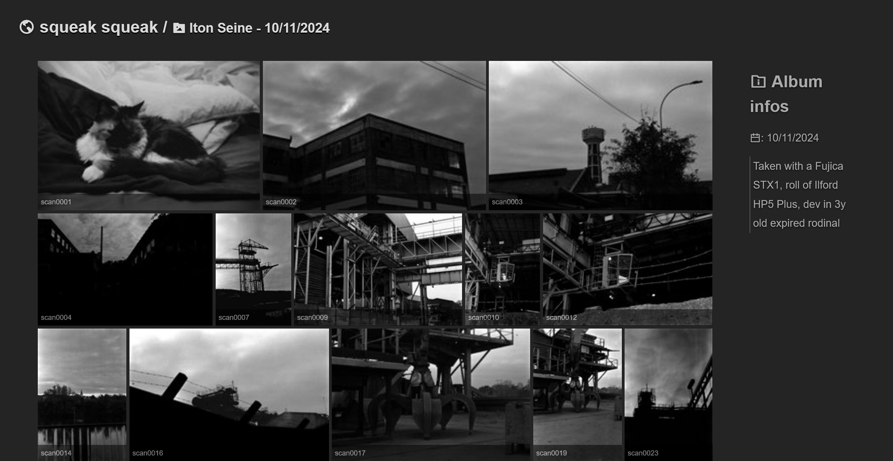
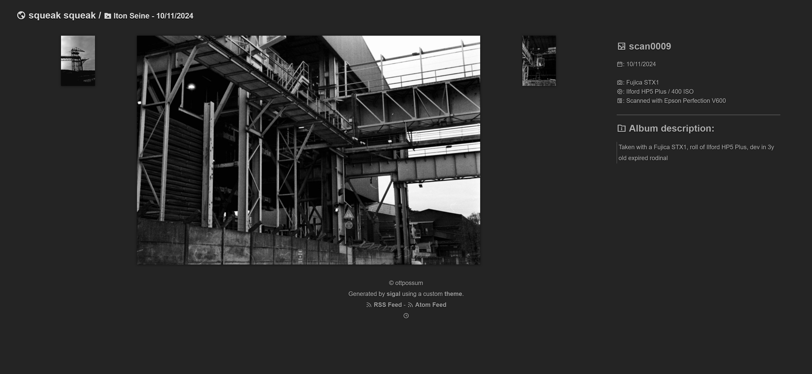

# Ottpossum personal theme for Sigal

A simple theme for [Sigal](https://github.com/saimn/sigal) using:
- [Justified Gallery](https://miromannino.github.io/Justified-Gallery/)
- [Lightbox](https://lokeshdhakar.com/projects/lightbox2/)
- based on [krylovsk sigal-justlight](https://github.com/krylovsk/sigal-justlight)




## Features

* Media view lightbox with [Lightbox](https://lokeshdhakar.com/projects/lightbox2/)
* Album view with [Justified Gallery](https://miromannino.github.io/Justified-Gallery/)
* Collection view based on Sigal's built-in [Galleria](https://github.com/saimn/sigal/tree/master/sigal/themes/galleria) theme
* OpenGraph (and twitter) embeds

## Configuration

Set the thumbnails to `320px` width and disable their cropping, i.e.:

```python
img_size = (1024, 768)
make_thumbs = True # to have thumbs *shrug*
thumb_size = (200, 150)
thumb_fit = False
keep_orig = True # for the lightbox
# you will also need the media_page plugin !
plugins = [
    ...
    'sigal.plugins.media_page'
    ...
]
# Custom settings
embeds_url = "https://your.gallery.tld/" # with the final /
# Leave like that if you haven't made your own changes in your repository
custom_theme_url = "https://github.com/rhaamo/sigal-ottpossum"
```

## Special markdown formatting options

Some parts of the theme will uses the markdown meta, such as listing custom Film used, camera, scanner, or aperture/speed etc.

### Album markdown options

Note: `FilmScan` is needed to show the ISO, camera, aperture, speed etc. in media pages.

- `FilmUsed`: The film used, example "Ilford HP5 Plus"
- `FilmISO`: ISO rating of the film, example "400"
- `FilmCamera`: The camera used, example "Nikon F90x"
- `FilmScan`: Is it a film that have been scanned? true or entirely ommit the line
- `FilmScanner`: The scanner model "Epson V600" "DSLR whatever"

### Pictures markdown options

- `ShotAperture`: Example "8", will shows as "f/8"
- `ShotSpeed`: Example "1/200"
- `ShotISO`: Will override `FilmISO`, example "200"
- `ShotFocal`: Example "100 mm"
